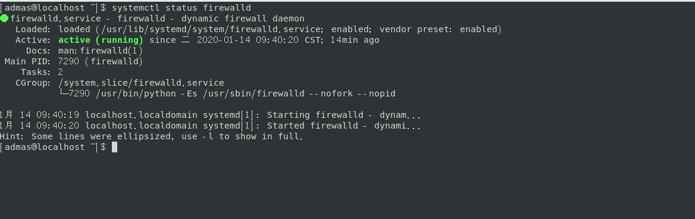

# CentOS 防火墙配置

## 查看防火墙状态

``` shell
sudo systemctl status firewalld
```

返回结果:



## * 开启防火墙

``` shell
sudo systemctl restart firewalld
```

## * 关闭防火墙

``` shell
sudo systemctl stop firewalld
```

## * 开启一个端口

``` shell
firewall-cmd --zone=public --add-port=80/tcp --permanent (--permanent 永久生效)
```

## * 重新载入

``` shell
firewall-cmd reload
```

## * 查看

``` shell
firewall-cmd --zone=public --query-port=80/tcp
```

## * 删除

``` shell
firewall-cmd --zone=public --remove-port=80/tcp --permanent
```

## * 查看当前开放了那些端口

``` shell
firewall-cmd --list-service
```

## * 查看还有那些服务可以打开

``` shell
firewall-cmd --get-services
```

## * 查看所有打开的端口

``` shell
firewall-cmd --zone=public --list-ports
```
