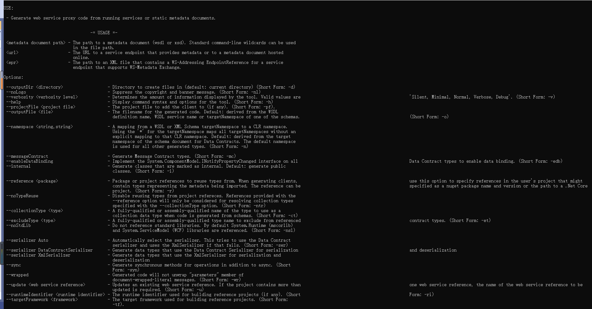

# dotnet-svcutil 工具

Windows Communication Foundation (WCF) dotnet-svcutil 工具是一种 .NET Core CLI 工具，此工具从网络位置上的 Web 服务中或从 WSDL 文件中检索元数据，并生成包含访问 Web 服务操作的客户端代理方法的 WCF 类

## 安装条件

| 版本 |  条件  |
| :--- | :----|
| dotnet svcutil 1.x | dotnet svcutil 2.x |
| * .Net Core 1.0.4 SKD More | .NET Core 2.1 SDK More |

## 安装 dotnet-svcutil NuGet 包作为 CLI 工具

* 方式一

dotnet svcutil 1.x

在编辑器中打开 HelloSvcutil.csproj 项目文件，编辑 Project 元素，并使用下面的代码添加 dotnet-svcutil NuGet 包作为 CLI 工具引用

``` XML
<ItemGroup>
  <DotNetCliToolReference Include="dotnet-svcutil" Version="1.0.*" />
</ItemGroup>
```

然后使用 dotnet restore 命令还原 dotnet-svcutil 包，如下所示：

``` Shell
dotnet restore
```

* 方式二

``` shell
dotnet tool install dotnet-svcutil
```

## 演示

Microsoft (R) WCF Service Model Proxy Generation Tool for .Net Core platform
[Microsoft.Tools.ServiceModel.Svcutil, Version 2.0.1]
Copyright (c) Microsoft Corporation.  All rights reserved.This tool collects information about how it is used in order to improve the tool. This functionality can be disabled by setting the environment variable "DOTNET_SVCUTIL_TELEMETRY_OPTOUT" to 1.

### 参数

* URL  

提供在线主机服务节点文档的URL地址

``` shell
dotnet-svcutil http://example.com/service.svc?wsdl  #产生客户端代码从一个运行的服务或者在线源数据文档。
```

| 参数 | 作用 | 简写 |
| :------: | :------| :-------: |
| --outputDir      |  #创建文件保存的路径（默认当前路径） | -d |
| --noLogo         |  #禁止产生版权和标志信息  | -nl |
| --verbosity      |  #决定产生展示信息的数量, 合法的参数值为: 'Silent, Minimal, Normal, Verbose, Debug' | -v  |
| --projectFile project file | #添加Client的项目文件（if any） | -pf |
| --outputFile file | #产生文件代码的名称 Default: derived from the WSDL definition name, WSDL service name   or targetNamespace of one of the schemas. |  -o |
| --namespace | #命名空间 - A mapping from a WSDL or XML Schema targetNamespace to a CLR namespace. Using the '*' for the targetNamespace maps all targetNamespaces without an explicit mapping to that CLR namespace. Default: derived from the target namespace of the schema document for Data Contracts. The default namespace is used for all other generated types. (Short Form: -n) |  -n |
| --messageContract | #产生消息协议类型 | -mc |
| --enableDataBind  | #数据绑定类型 | -edb |
| --internal | #产生代码的类的访问修饰符为 internal，默认 public |  -i |
| --reference package | #引用的包/项目 | -r |
| --noTypeReuse | #禁用复用类型从项目引用中 | -ct |
| --collectionType type | # | -ct |
| --excludeType type | # | -et |
| --noStdLib | #不引用标准类库,more引用Sytem.Runtime, System.ServiceModel | -nsl |
| --serializer auto | #自动选择序列化器 | -ser |
| --serializer DataContractSerializer | #选择序列化数据类型的序列化器 | |
| --serializer XmlSerializzer | #生成代码的XML序列化器 | |
| --sync | #异步代码 | -syn |
| --runtimeIdentifier| The runtime identifier used for building reference projects (if any).| -ri |
| --targetFramework | #The target framework used for building reference projects | -tf |


### 参数示例


