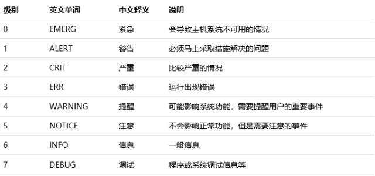

# Centos系统查看系统日志

## 系统日志的三种类型

* 内核及系统日志
* 用户日志
* 程序日志

## 常见日志文件

| 路径 | 作用 |
| :-------- | :--------- |
| /var/log/messages      | Linux内核及各种应用程序的公共日志信息|
| /var/log/cron          | 记录crond计划任务产生的日志信息 |
| /var/log/dmesg         | 记录Linux操作系统在引导过程中各种事件信息 |
| /var/log/maillog       | 记录进入或者发出的电子邮件信息 |
| /var/log/lastlog       | 记录每个用户的登录事件 |
| /var/log/secure        | 用户认证相关的安全事件信息 |
| /var/log/wtmp          | 记录每个用户登录，注销，系统启动及停机事件 |
| /var/log/btmp          | 记录失败的及错误的登录尝试及验证事件 |

## 系统日志的优先级

