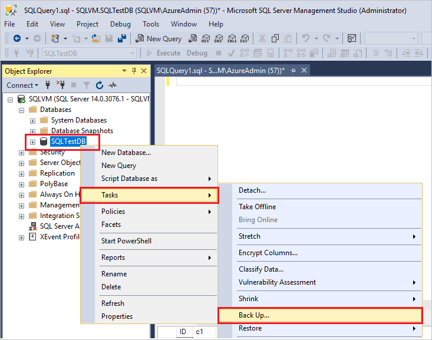

# sql server 备份和还原

## 数据库备份

### SQL Server Management Studio (SSMS)

操作步骤为:

1. 点击数据库
2. 点击任务
3. 选择备份
4. 选择路径
5. 确定



### 命令行方式

``` sql
BACKUP DATABASE [SQLTestDB] 
TO DISK = N'C:\Program Files\Microsoft SQL Server\MSSQL14.MSSQLSERVER\MSSQL\Backup\SQLTestDB.bak' 
WITH NOFORMAT, NOINIT,  
NAME = N'SQLTestDB-Full Database Backup', SKIP, NOREWIND, NOUNLOAD,  STATS = 10
GO
```

## 还原数据库

### SSMS

在对象资源管理器中右键单击“数据库”节点，然后选择“还原数据库”


### Tranact-SQL

``` sql
EXEC msdb.dbo.sp_delete_database_backuphistory @database_name = N'SQLTestDB'
GO

USE [master]
DROP DATABASE [SQLTestDB]
GO
```
